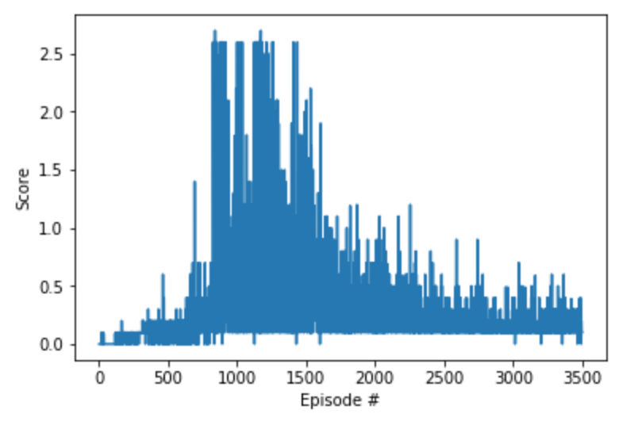

## Implmentation and Algorithm

We train the agent using a DDPG as introduced in [CONTINUOUS CONTROL WITH DEEP REINFORCEMENT
LEARNING](https://arxiv.org/pdf/1509.02971.pdf). Some hyper parameters used in training:

Name | Value
---|---
actor fc1 units | 100
actor fc2 units | 100
critic fc1 units | 200
critic fc2 units | 200
actor learning rate | 1.1e-4
critic learning rate | 5.7e-4
buffer size | 1e6
batch size | 128
Gamma (belman equation discount factor) | 0.99
tau (soft update of target network's parameters) | 6.64e-3

## Neural Net Model

### Actor
Input layer: 24 units
Hidden Layer w/ Relu 1: 100 units
Hidden Layer w/ Relu 2: 100 units
Output layer (tanh): 2 units

### Critic
Input layer: 48 units
Hidden Layer w/ Relu 1: 200 units
Hidden Layer w/ Relu 2: 200 units
Output Layer: 1

Each layer is fully connected with RELU activation.

Each actor can only access its own input environment, while the critic can use both agents' environment variables to learn the Q value.

## Episodes

It required 1500 episodes to train the agent and achieve an average score of 0.5+ over 100 episodes as per this graph:

Note that even with the same hyperparameters, the network does not always converge to the same results. Multiple runs using the same parameters are required before achieving the 0.5+ scores.

In the notebook, multiple runs are shown. The second last run has a graph showing 0.5+ scores.

## Future Work
Future work should focus on learning the task with more consistency. Modifying the agent to focus on the parts of the memory buffer that yields more outcome might help.
